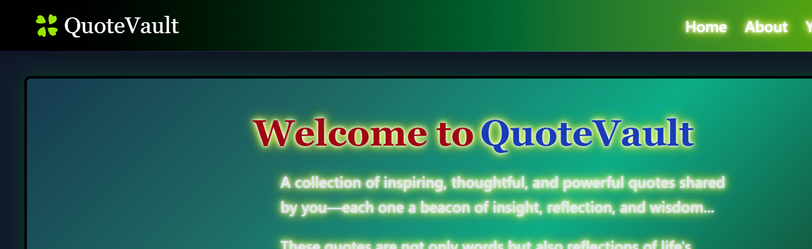

# 🌐 QuoteVault Frontend

A responsive and interactive frontend for **QuoteVault**, built using React and Tailwind CSS.  
It allows users to explore, add, edit, and manage quotes with a clean and modern UI.

---

## 🚀 Features

- Browse all quotes from users
- Add new quotes with optional password protection
- Edit and delete quotes securely
- Quote of the Day (dynamic)
- Recent quotes carousel
- Tag-based categorization
- Fully responsive design (mobile + desktop)
- Dark mode support

---

## 🛠️ Tech Stack

- **React.js** – UI development
- **Vite** – Fast build tool
- **Tailwind CSS** – Styling
- **Axios** – API requests
- **React Router DOM** – Routing
- **React Toastify** – Notifications
- **Lucide React / React Icons** – Icons

---

## 📸 Preview



---

---

## ⚙️ Environment Variables

Create a `.env` file:

---

---

##  Setup Instructions

```bash
# Clone repo
git clone <https://github.com/devvrat-singh-gth/quoteApp-frontend>

# Go into project
cd frontend

# Install dependencies
npm install

# Run development server
npm run dev
